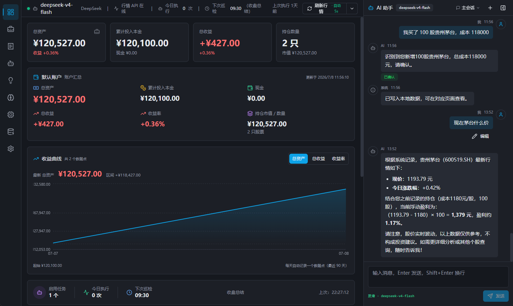

# AI 炒股 Agent 系统

> 一个本地运行的个人投资助手桌面应用：持仓管理 + AI 聊天 + 定时 Agent 巡检 + 投资记忆库。
> Windows 桌面 GUI（Tauri + React + TypeScript），双击 exe 即可用，无需部署服务。

[](./LICENSE)
[](./tsconfig.json)
[](https://tauri.app)

---

## 这是什么

AI 炒股 Agent 系统是一款面向个人投资者的**本地桌面应用**。它不是传统的股票软件，也不是简单的记账工具，而是一个结合了「持仓记录、行情监控、AI 聊天、定时 Agent、投资记忆库」的个人投资工作站。

核心理念：

```text
用户负责决策，AI 负责记录、监控、分析和提醒。
```

系统**不直接替用户下单、不承诺收益、不做自动交易**，定位是辅助分析和投资复盘。

## 核心能力

| 能力 | 说明 |
|------|------|
| 持仓 / 账户管理 | 记录本金、现金、持仓、交易、收益、每日资产快照 |
| 自然语言解析持仓 | 对 AI 说「我买了 300 股贵州茅台，成本 1680」，自动识别并写入 |
| AI 聊天助手 | 流式响应、Markdown 渲染、Token 用量统计、多会话管理 |
| 定时 Agent 巡检 | 「每隔 1 小时帮我看一次持仓」——自动分析并输出观点 |
| 投资记忆库 | 记住用户偏好、关注板块、买入理由、历史风险提醒 |
| 风控条件提醒 | 价格跌破、浮亏超过、总资产回撤等条件触发通知 |
| 行情数据接入 | 新浪财经实时报价，股票代码智能匹配覆盖 A 股 5000+ 只 |
| API Key 安全凭据 | Key 存入系统凭据管理器，全程不离开 Rust 进程 |
| 多模型支持 | OpenAI / DeepSeek / Qwen / GLM / Kimi / Anthropic / Gemini / Ollama / Custom |
| Tauri 代理 AI 调用 | API Key 经 Rust 端代理，前端不直接接触 |

## 截图 / 界面布局

```text
左侧：功能导航（总览 / 持仓 / 交易 / Agent / 记忆 / 模型 / 数据源 / 设置）
中间：当前功能页面（持仓卡片、资产总览、Agent 任务等）
右侧：AI 聊天 / Agent 对话（可收起）
```

## 快速开始

### 环境要求

- [Node.js](https://nodejs.org/) 18+
- [Rust](https://www.rust-lang.org/tools/install) 工具链（stable）
- Windows 10/11（macOS / Linux 理论支持，但未充分测试）

### 安装与运行

```bash
# 1. 安装前端依赖
npm install

# 2. 启动开发模式（同时启动 Vite 和 Tauri）
npm run tauri:dev

# 3. 打包成安装程序（产物在 src-tauri/target/release/bundle/）
npm run tauri:build
```

> Windows PowerShell 默认执行策略可能阻止 npm 脚本，可在当前会话执行：
> `Set-ExecutionPolicy -Scope Process -ExecutionPolicy Bypass`

### 首次使用

1. 启动后会进入 6 步引导：风险声明 → 选择厂商 → 填写 API Key → 测试连接 → 录入本金 → 生成 Demo 数据
2. 在聊天框直接对 AI 说「我本金 10 万，现金还剩 2 万」即可记录账户
3. 说「我买了 300 股贵州茅台，成本 1680」即可记录持仓
4. 说「每隔 1 小时帮我看一次」即可创建定时 Agent 任务

## 技术栈

| 模块 | 技术 | 作用 |
| --- | --- | --- |
| 桌面应用壳 | Tauri 1.6 | 打包桌面应用、本地文件读写、API Key 安全存储、系统通知、行情 HTTP 代理 |
| 前端框架 | React 18 | 构建界面和交互 |
| 类型系统 | TypeScript 5 (strict) | 保证数据结构可靠 |
| 构建工具 | Vite 5 | 快速开发和打包 |
| 样式 | Tailwind CSS 3 | 实现现代界面 |
| UI 组件 | shadcn/ui | 按钮、弹窗、卡片、表单 |
| 状态管理 | Zustand 5 | 轻量全局状态 |
| Markdown | react-markdown + remark-gfm | 表格、代码高亮渲染 |
| 图表 | Recharts | 收益曲线、资产变化 |
| 图标 | lucide-react | 统一图标 |
| API Key 存储 | keyring (Windows Credential Manager) | Key 全程不进 JS 内存 |

## 项目结构

```text
src/
├── components/      # UI 组件（app-shell / common / dashboard / ui）
├── domain/          # 领域模型类型定义（account / agent / position / chat ...）
├── lib/              # 工具函数（format / utils）
├── pages/           # 页面（Dashboard / Positions / Agent / Settings ...）
├── services/        # 业务服务（aiGateway / agentRunner / marketData / scheduler ...）
├── store/           # Zustand 全局状态（appStore）
├── styles/          # 全局样式
└── App.tsx          # 应用入口
src-tauri/
├── src/main.rs      # Rust 命令（数据读写 / 行情代理 / API Key / AI 代理 / 通知）
├── Cargo.toml
└── tauri.conf.json
```

## 数据存储

所有数据保存在本地（Windows: `%APPDATA%\AI Stock Agent\`），以 JSON 文件形式存储，无需安装数据库。前端不直接传文件路径，通过 Tauri 命令按 key 白名单读写。

API Key 不写入 JSON，通过 `keyring` 存入 Windows Credential Manager。

## 贡献

欢迎 Issue 和 PR。请先阅读 [CONTRIBUTING.md](./CONTRIBUTING.md)。

## 许可证

[MIT](./LICENSE)
